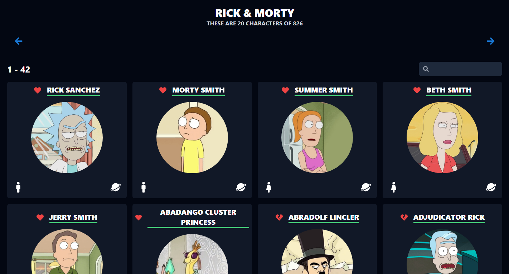

    

# Rick & Morty Character Extraction

👽 This website allows you to view and search for characters from the popular animated TV show Rick & Morty. Check it out here: https://daldude1.github.io/Rick-and-Morty/

## Features

🔍 Search: You can search for characters by name or species.

📜 List: You can view a list of all characters in the show.

👀 Details: You can view details about each character, including their image, status, species, gender, and origin.

## Technologies Used

🛠️ This website was built using HTML, CSS, and JavaScript.

🔍 The character data was obtained from the Rick & Morty API (https://rickandmortyapi.com/).

## How to Use

👨‍💻 Simply visit the website at https://daldude1.github.io/Rick-and-Morty/ and start exploring the characters!

## Future Improvements

🚀 In the future, we plan to add more features to the website, such as filtering characters by episode appearances and sorting characters by various attributes.

## Credits

🙏 Thanks to the creators of the Rick & Morty API for providing the character data used in this website.

👨‍💻 This website was created by Daldude1.